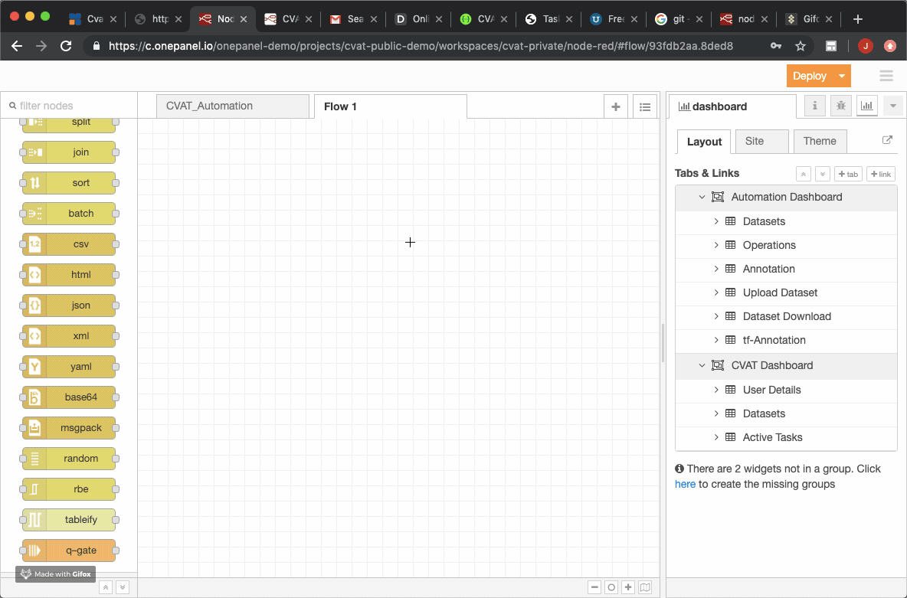

# CVAT Automation Dashboard

## Import Flows to NodeRed
Import the flow  `flows.json` to nodered workspace.
`NoderedMenu --> Import --> Clipboard --> Upload json or paste the content of the file `

## Install npm Modules
1. node-red-contrib-pythonshell `npm install node-red-contrib-pythonshell`
2. node-red-contrib-queue-gate  `npm install node-red-contrib-queue-gate`
3. node-red-contrib-tableify `npm install node-red-contrib-tableify`
4. node-red-dashboard `npm install node-red-dashboard`
## Deploy the node
Click on the Deploy node button
